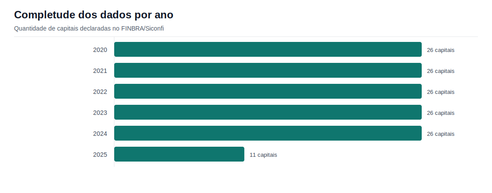
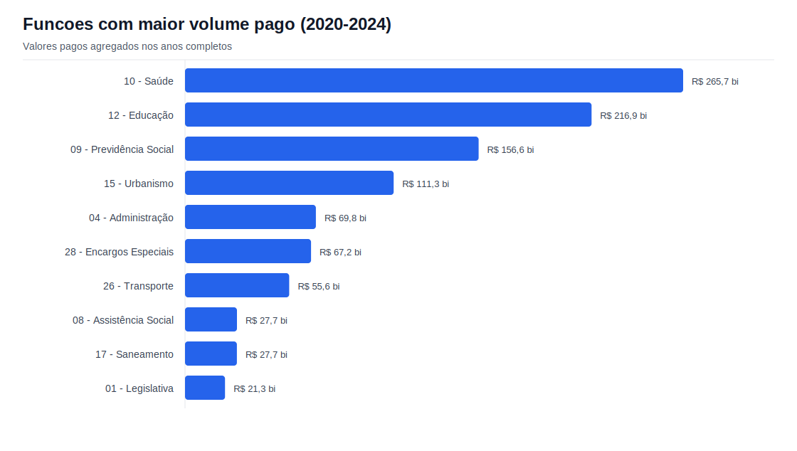
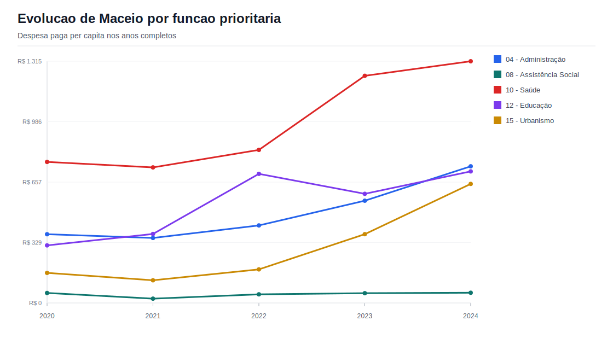
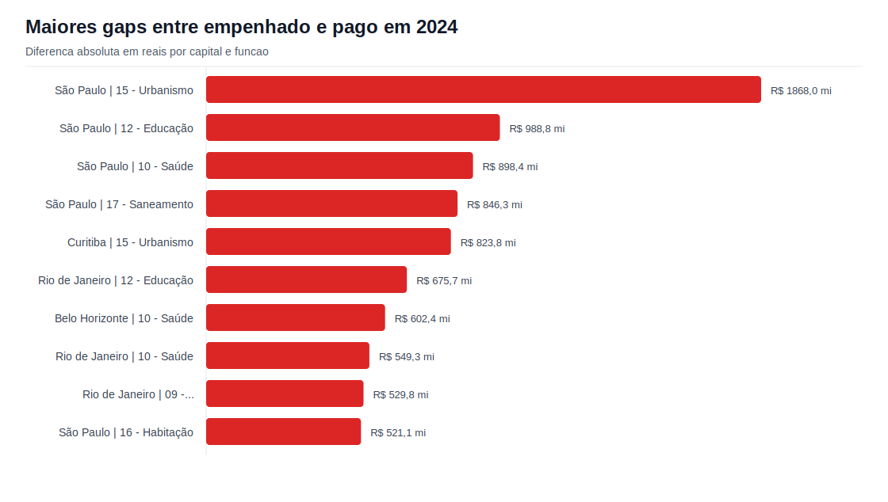
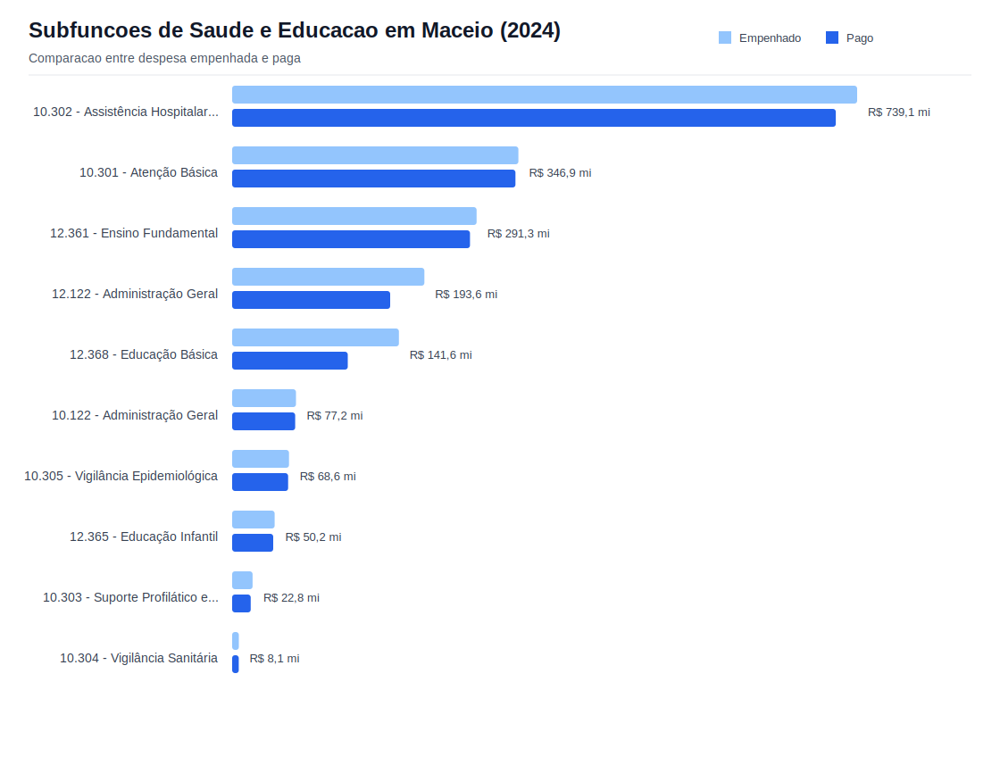

# Relatorio de analise

## Escopo

Analise das despesas por funcao das capitais brasileiras no FINBRA/Siconfi. O foco e a comparacao entre despesas empenhadas e despesas pagas.

## Completude dos dados

| ano | qtd_capitais |
| --- | --- |
| 2020 | 26 |
| 2021 | 26 |
| 2022 | 26 |
| 2023 | 26 |
| 2024 | 26 |
| 2025 | 11 |

O ano de 2025 tem 11 capitais declaradas, contra 26 nos anos completos. Por isso, as conclusoes principais usam 2020 a 2024; anos parciais ficam apenas como referencia de disponibilidade.

## Funcoes com maior volume pago, 2020 a 2024

| funcao | pago | taxa_execucao |
| --- | --- | --- |
| 10 - Saúde | R$ 265.713.242.125,31 | 93,3% |
| 12 - Educação | R$ 216.875.066.023,71 | 88,1% |
| 09 - Previdência Social | R$ 156.603.792.296,40 | 97,4% |
| 15 - Urbanismo | R$ 111.286.746.786,53 | 85,4% |
| 04 - Administração | R$ 69.819.827.910,49 | 93,8% |
| 28 - Encargos Especiais | R$ 67.215.485.446,37 | 97,8% |
| 26 - Transporte | R$ 55.561.905.214,59 | 94,0% |
| 08 - Assistência Social | R$ 27.710.279.611,45 | 92,0% |

Saude, Educacao, Administracao e Urbanismo aparecem entre as areas mais relevantes do gasto municipal. A taxa de execucao deve ser lida junto com a natureza da funcao, pois obras, contratos longos e restos a pagar podem deslocar pagamentos para exercicios seguintes.

## Posicao de Maceio em funcoes prioritarias

| ano | funcao | pago_per_capita | taxa_execucao | ranking_pago_per_capita |
| --- | --- | --- | --- | --- |
| 2020 | 04 - Administração | R$ 373,73 | 99,3% | 9 |
| 2020 | 08 - Assistência Social | R$ 54,54 | 97,3% | 18 |
| 2020 | 10 - Saúde | R$ 766,94 | 98,7% | 15 |
| 2020 | 12 - Educação | R$ 313,16 | 89,2% | 24 |
| 2020 | 15 - Urbanismo | R$ 163,71 | 89,5% | 23 |
| 2021 | 04 - Administração | R$ 353,61 | 97,9% | 10 |
| 2021 | 08 - Assistência Social | R$ 23,62 | 82,2% | 24 |
| 2021 | 10 - Saúde | R$ 737,29 | 97,7% | 18 |
| 2021 | 12 - Educação | R$ 375,40 | 82,9% | 24 |
| 2021 | 15 - Urbanismo | R$ 123,39 | 75,7% | 22 |
| 2022 | 04 - Administração | R$ 421,85 | 99,0% | 10 |
| 2022 | 08 - Assistência Social | R$ 47,12 | 87,1% | 20 |
| 2022 | 10 - Saúde | R$ 832,41 | 98,4% | 18 |
| 2022 | 12 - Educação | R$ 702,25 | 94,3% | 16 |
| 2022 | 15 - Urbanismo | R$ 182,68 | 78,6% | 21 |
| 2023 | 04 - Administração | R$ 556,31 | 98,0% | 8 |
| 2023 | 08 - Assistência Social | R$ 53,37 | 89,3% | 23 |
| 2023 | 10 - Saúde | R$ 1.235,46 | 97,8% | 9 |
| 2023 | 12 - Educação | R$ 593,80 | 94,4% | 24 |
| 2023 | 15 - Urbanismo | R$ 374,07 | 78,8% | 19 |
| 2024 | 04 - Administração | R$ 743,19 | 97,8% | 6 |
| 2024 | 08 - Assistência Social | R$ 55,68 | 89,7% | 23 |
| 2024 | 10 - Saúde | R$ 1.314,67 | 97,4% | 13 |
| 2024 | 12 - Educação | R$ 715,71 | 85,5% | 25 |
| 2024 | 15 - Urbanismo | R$ 647,41 | 80,9% | 12 |

Maceio foi comparada por gasto pago per capita entre capitais no mesmo ano e funcao. Esse indicador reduz a distorcao causada pelo tamanho populacional das capitais.

## Maiores diferencas entre empenhado e pago em 2024

| ano | capital | uf | funcao | diferenca_empenhado_pago | taxa_execucao |
| --- | --- | --- | --- | --- | --- |
| 2024 | São Paulo | SP | 15 - Urbanismo | R$ 1.868.028.579,39 | 84,5% |
| 2024 | São Paulo | SP | 12 - Educação | R$ 988.795.707,13 | 95,8% |
| 2024 | São Paulo | SP | 10 - Saúde | R$ 898.373.166,38 | 96,1% |
| 2024 | São Paulo | SP | 17 - Saneamento | R$ 846.312.248,39 | 70,5% |
| 2024 | Curitiba | PR | 15 - Urbanismo | R$ 823.770.891,18 | 54,4% |
| 2024 | Rio de Janeiro | RJ | 12 - Educação | R$ 675.678.223,06 | 90,6% |
| 2024 | Belo Horizonte | MG | 10 - Saúde | R$ 602.402.441,94 | 89,9% |
| 2024 | Rio de Janeiro | RJ | 10 - Saúde | R$ 549.348.882,05 | 92,8% |
| 2024 | Rio de Janeiro | RJ | 09 - Previdência Social | R$ 529.797.922,55 | 92,2% |
| 2024 | São Paulo | SP | 16 - Habitação | R$ 521.127.674,99 | 90,1% |
| 2024 | São Paulo | SP | 26 - Transporte | R$ 456.746.554,47 | 95,8% |
| 2024 | Porto Alegre | RS | 10 - Saúde | R$ 355.816.955,63 | 87,3% |
| 2024 | Belo Horizonte | MG | 12 - Educação | R$ 323.793.901,29 | 90,3% |
| 2024 | São Luís | MA | 12 - Educação | R$ 276.767.949,34 | 78,6% |
| 2024 | Rio de Janeiro | RJ | 15 - Urbanismo | R$ 237.193.538,58 | 94,9% |

Esses casos apontam onde a distancia em reais entre compromisso orcamentario e pagamento efetivo foi maior no ano de referencia. A diferenca pode indicar restos a pagar, atraso de execucao ou caracteristicas do calendario contratual.

## Subfuncoes de Saude e Educacao em Maceio, 2024

| conta | empenhado | pago | taxa_execucao |
| --- | --- | --- | --- |
| 10.302 - Assistência Hospitalar e Ambulatorial | R$ 765.239.820,97 | R$ 739.098.739,88 | 96,6% |
| 10.301 - Atenção Básica | R$ 350.505.096,86 | R$ 346.872.424,92 | 99,0% |
| 12.361 - Ensino Fundamental | R$ 299.333.033,05 | R$ 291.273.033,05 | 97,3% |
| 12.122 - Administração Geral | R$ 235.354.744,17 | R$ 193.550.273,99 | 82,2% |
| 12.368 - Educação Básica | R$ 204.227.314,23 | R$ 141.609.400,11 | 69,3% |
| 10.122 - Administração Geral | R$ 78.133.279,68 | R$ 77.189.022,44 | 98,8% |
| 10.305 - Vigilância Epidemiológica | R$ 69.644.671,31 | R$ 68.567.166,70 | 98,5% |
| 12.365 - Educação Infantil | R$ 51.985.617,10 | R$ 50.237.143,03 | 96,6% |
| 10.303 - Suporte Profilático e Terapêutico | R$ 25.039.098,96 | R$ 22.785.057,90 | 91,0% |
| 10.304 - Vigilância Sanitária | R$ 8.211.355,92 | R$ 8.141.131,48 | 99,1% |
| 12.367 - Educação Especial | R$ 3.440.711,17 | R$ 3.440.711,17 | 100,0% |
| 12.366 - Educação de Jovens e Adultos | R$ 1.239.541,75 | R$ 1.239.541,75 | 100,0% |
| 10.306 - Alimentação e Nutrição | R$ 77.650,98 | R$ 77.650,98 | 100,0% |

As subfuncoes detalham quais frentes puxam o gasto dentro das funcoes agregadas. Em Maceio, esse recorte mostra onde os pagamentos se concentram dentro de Saude e Educacao.

## Decisoes tecnicas

- Os ZIPs originais sao extraidos por codigo para `dados_extraidos/`.
- A leitura trata `latin-1`, separador `;`, tres linhas de metadados e valores com decimal brasileiro.
- A coluna `Conta` e classificada para separar funcao, subfuncao, totais e demais subfuncoes, evitando dupla contagem.
- A base consolidada e salva em `dados_processados/finbra_consolidado.csv.gz`.
- A base consultavel usa SQLite em `dados_processados/finbra_consolidado.sqlite`, com indices nas dimensoes mais usadas.
- Os anos completos sao inferidos pela quantidade maxima de capitais declaradas, sem fixar manualmente 2024.
- Os graficos sao SVGs gerados por codigo, sem depender de ferramenta externa de visualizacao.
